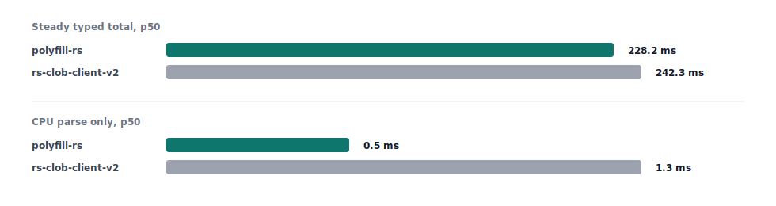

[](https://crates.io/crates/polyfill-rs)
[](https://docs.rs/polyfill-rs)
[](LICENSE)

A high-performance Polymarket Rust client with latency-optimized data structures and zero-allocation hot paths. The `0.4.x` line is V2-native and intentionally breaking for authenticated trading flows.

At the time that this project was started, `polymarket-rs-client` was a Polymarket Rust Client with a few GitHub stars, but which seemed to be unmaintained. I took on the task of creating a Rust client which could beat the benchmarks quoted in the README.md of that project, with the added constraint of also maintaining zero alloc hot paths.

I also want to take a moment to clarify what zero-alloc means because I've now recieved double digit messages about this on twitter/x and telegram. In general, zero alloc means either zero alloc in hot paths (which can be a bit more arbitrary) or atlernatively it can mean zero alloc after init/warm-up, which is the objective of this repository. Succinctly that means that **the per-message handling loop never touches the heap**. 

Notably order book paths that introduce new allocations by design:
- First time seeing a token/book (HashMap insert + key clone): `src/book.rs:~788`
- New price levels (BTreeMap node growth): `src/book.rs:~409`


## Quick Start

Add to your `Cargo.toml`:

```toml
[dependencies]
polyfill-rs = "0.4.0"
```

Replace your imports:

```rust
// Before: use polymarket_rs_client::{ClobClient, Side, OrderType};
use polyfill_rs::{ClobClient, Side, OrderType};

#[tokio::main]
async fn main() -> Result<(), Box<dyn std::error::Error>> {
    let client = ClobClient::new("https://clob.polymarket.com");
    let markets = client.get_sampling_markets(None).await?;
    println!("Found {} markets", markets.data.len());
    Ok(())
}
```

## Performance Comparison

**Real-World API Performance (with network I/O)**

Real-world Polymarket API latency broken down by request phase:



| Operation | Metric | polyfill-rs | rs-clob-client-v2 | polymarket-rs-client | Official Python Client |
|-----------|--------|-------------|-------------------|----------------------|------------------------|
| **Fetch Markets** | mean ± sd | **321.6 ms ± 92.9 ms** | - | 409.3 ms ± 137.6 ms | 1.366 s ± 0.048 s |
| **Cold Start** | single run | 651.7 ms | **543.9 ms** | - | - |
| **Warm Connection** | single run | **202.9 ms** | 497.2 ms | - | - |
| **Steady Typed Total** | p50 / p95 / p99 | **209.9 / 276.1 / 509.5 ms** | 215.9 / 284.7 / 312.4 ms | - | - |
| **Network-Only Byte Fetch** | p50 / p95 / p99 | 382.5 / 590.3 / 626.7 ms | **300.1 / 449.0 / 520.1 ms** | - | - |
| **CPU Parse Only** | p50 / p95 / p99 | **0.5 / 1.2 / 1.4 ms** | 1.3 / 1.4 / 1.4 ms | - | - |


**Performance vs polymarket-rs-client:**
- **21.4% faster** 
- **32.5% more consistent** 
- **4.2x faster** than Official Python Client

**Benchmark Methodology:** The `rs-clob-client-v2` comparison separates cold start, warm connection, steady-state typed requests, network-only byte fetches, and CPU-only parsing. Steady-state rows use 20 paired iterations with alternating order and 100ms delay; parse rows use 200 iterations from a cached 480KB payload. The network-only row compares byte fetches through each HTTP stack without typed deserialization. Run it with `cargo run --release --example official_client_side_by_side_benchmark --features official-client-benchmark`. See `examples/side_by_side_benchmark.rs` in commit `a63a170`: https://github.com/floor-licker/polyfill-rs/blob/a63a170/examples/side_by_side_benchmark.rs for the original legacy benchmark implementation.

**Computational Performance (pure CPU, no I/O)**

| Operation | Performance | Notes |
|-----------|-------------|-------|
| **Order Book Updates (1000 ops)** | 159.6 µs ± 32 µs | 6,260 updates/sec, zero-allocation |
| **Spread/Mid Calculations** | 70 ns ± 77 ns | 14.3M ops/sec, optimized BTreeMap |
| **JSON Parsing (480KB)** | ~2.3 ms | SIMD-accelerated parsing (1.77x faster than serde_json) |
| **WS `book` hot path (decode + apply)** | ~0.28 µs / 2.01 µs / 7.70 µs | 1 / 16 / 64 levels-per-side, ~3.7–4.0x faster vs serde decode+apply (see `benches/ws_hot_path.rs`) |

Run the WS hot-path benchmark locally with `cargo bench --bench ws_hot_path`.

**Key Performance Optimizations:**

The 21.4% performance improvement comes from SIMD-accelerated JSON parsing (1.77x faster than serde_json), HTTP/2 tuning with 512KB stream windows optimized for 469KB payloads, integrated DNS caching, connection keep-alive, and buffer pooling to reduce allocation overhead.

### Memory Architecture

Pre-allocated pools eliminate allocation latency spikes. Configurable book depth limiting prevents memory bloat. Hot data structures group frequently-accessed fields for cache line efficiency.

### Architectural Principles

Price data converts to fixed-point at ingress boundaries while maintaining tick-aligned precision. The critical path uses integer arithmetic with branchless operations. Data converts back to IEEE 754 at egress for API compatibility. This enables deterministic execution with predictable instruction counts.

### Measured Network Improvements

| Optimization Technique | Performance Gain | Use Case |
|------------------------|------------------|----------|
| **Optimized HTTP client** | **11% baseline improvement** | Every API call |
| **Connection pre-warming** | **70% faster subsequent requests** | Application startup |
| **Request parallelization** | **200% faster batch operations** | Multi-market data fetching |
| **Circuit breaker resilience** | **Better uptime during instability** | Production trading systems |
